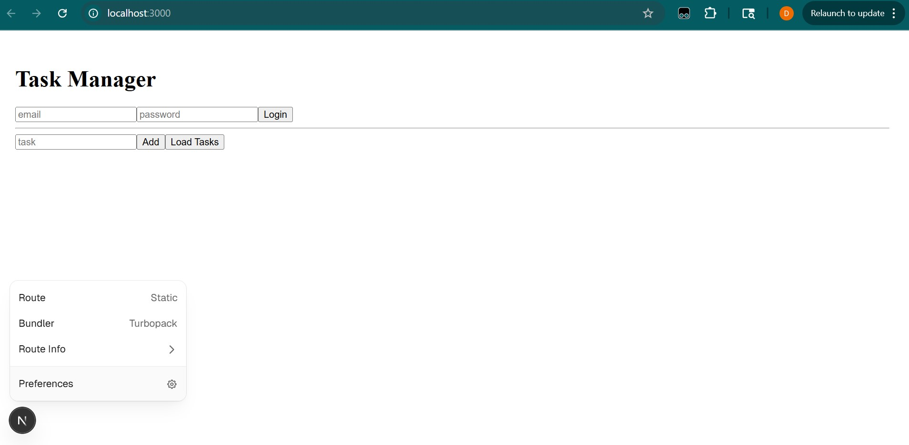

# 📝 Task Manager App (Part 1 + Track A)

A full-stack Task Manager application built using modern web technologies. This project includes authentication, task management, and a responsive UI.

---

## 🚀 Tech Stack

### Frontend
- Next.js (App Router)
- React
- Axios

### Backend
- Node.js
- Express.js
- Prisma ORM
- SQLite

---

## ✨ Features

### 🔐 Authentication
- User login using JWT

### 📋 Task Management
- Add tasks
- View tasks
- Task status (Completed / Pending)

### 🎨 UI
- Simple and clean interface
- Dark/Light mode toggle (if implemented)

---

## ⚙️ Setup Instructions

### Backend
cd backend
npm install
npx prisma generate
npx prisma db push
npm run dev

### Frontend
cd frontend
npm install
npm run dev

---

## 📌 Notes
- Backend should run before frontend
- Default backend port: 5000
- Frontend port: 3000 or 3001

---
## 📸 Local Host Page

### Home Page

---
## 👨‍💻 Author
Dipesh Shah